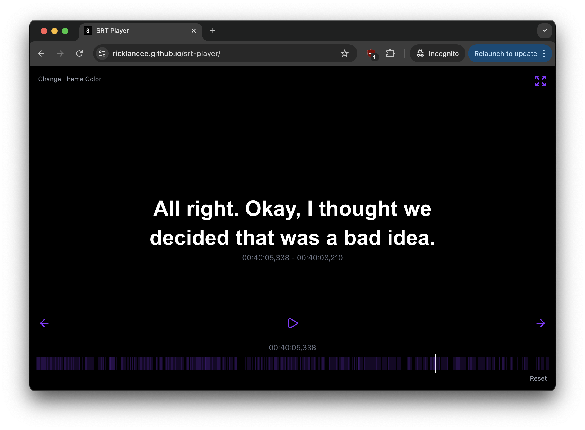

# SRT Player



**Live Demo:** https://ricklancee.github.io/srt-player/

A web-based SRT subtitle player with playback controls and customizable theming. Designed for watching movies in foreign-dubbed cinemas while following along with subtitles in your preferred language. Requires manual syncing with the cinema playback.

## Development

```bash
npm install
npm run dev
```

## Build

```bash
npm run build
```

## Deploy

The project is configured for GitHub Pages deployment. Push to the `main` branch to trigger automatic deployment.
